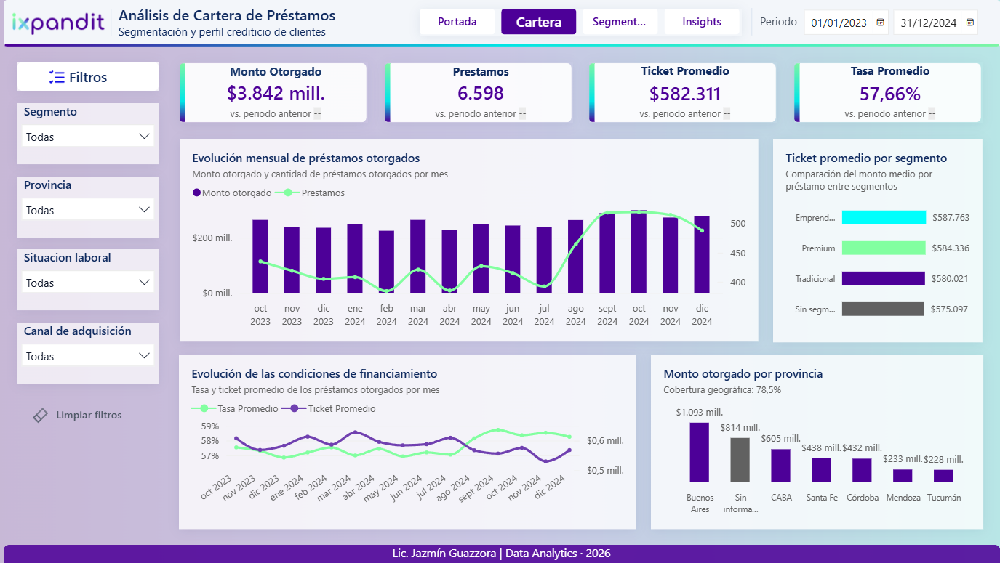

# Fintech Lending Analytics — Data Analyst Challenge

Challenge end-to-end desarrollado a partir de cinco fuentes de una fintech de préstamos personales. El proceso abarcó limpieza y normalización con **Python/pandas**, staging y modelado dimensional en **MySQL/SQL**, documentación del modelo y desarrollo de un dashboard interactivo en **Power BI**.

## 🔎 Metodología y decisiones

Las fuentes offline y online compartían un mismo espacio de identificadores, por lo que la reconciliación se realizó por `id_cliente`, sin recurrir a matching por nombre.

Se construyó un modelo curado compuesto por `dim_cliente`, `dim_variables_crediticias`, `dim_geografica`, `cliente_sucursal` y `fact_prestamos`.

Algunas decisiones relevantes:

- Los préstamos cuyo cliente no pudo reconciliarse se conservaron mediante un miembro técnico (`id_cliente = -1`), manteniendo además `id_cliente_origen` para trazabilidad.
- Los casos en que un cliente estaba asociado a más de una sucursal se preservaron mediante la tabla puente `cliente_sucursal`, sin seleccionar arbitrariamente una única sucursal.
- Los valores faltantes no fueron imputados sin evidencia. En particular, los `NULL` de atrasos históricos se conservaron como tales: no disponer del dato no implica que el cliente tenga cero atrasos.
- Se distinguió entre **reconciliación** y **completitud**: fue posible identificar al **98,7% de los clientes financiados**, aunque algunas variables analíticas presentan menor cobertura.

## 📊 Dashboard

**[Ver dashboard interactivo en Power BI](https://app.powerbi.com/view?r=eyJrIjoiMGIwM2I3MTEtNzMwOS00YTk3LWI2MGUtMjBiZGM5MzNjMTNjIiwidCI6IjEzNjhmZTVlLWMzNjAtNDI0ZC1iMjJiLTI3MGI0ZDc2ZjU0ZSIsImMiOjR9)**

El dashboard permite analizar cartera, evolución temporal, segmentación, condiciones financieras y calidad de datos.

### 🧭 Tips de navegación

- En **Cartera**, además del filtro de período, se puede seleccionar directamente un mes en los gráficos de evolución para actualizar los KPI y su comparación con el período anterior.
- Los filtros de **segmento, provincia, situación laboral y canal de adquisición** están sincronizados entre las páginas analíticas.
- Los gráficos permiten interacción cruzada con el resto de los visuales.
- Desde `···` → **Modo de enfoque** se puede ampliar cualquier gráfico para analizarlo en detalle.
- **Limpiar filtros** restablece el estado inicial del análisis.

## 💡 Algunos hallazgos

La actividad se acelera hacia el cierre de 2024, con un aumento del **31,4% de clientes financiados entre julio y septiembre**. Los segmentos presentan perfiles relativamente similares en ingreso y endeudamiento, mientras que el **49% del universo registra al menos un atraso histórico**.

En calidad de datos, la principal oportunidad detectada está en la **completitud de variables analíticas más que en la reconciliación de clientes**.

## 💬 Comentario personal

La visualización fue la etapa en la que me sentí más cómoda, pero el mayor aprendizaje estuvo en el modelado y la reconciliación. El desafío de decidir qué conservar, qué no inferir y cómo mantener trazabilidad entre fuentes me permitió trabajar el dato más allá de la visualización y pensar el proceso de punta a punta.

---

**Autora:** Lic. Jazmín Guazzora  
**Data Analytics | Business Intelligence**
